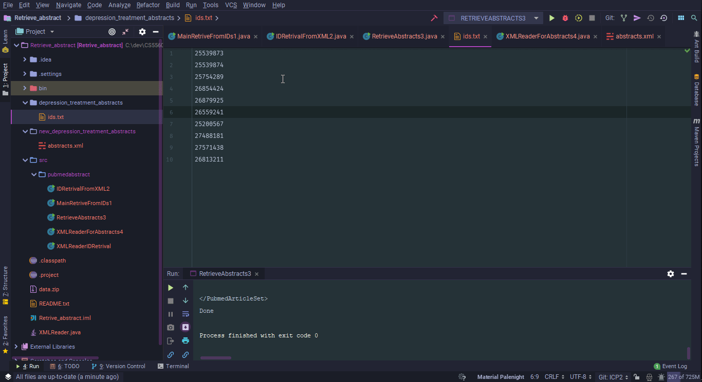
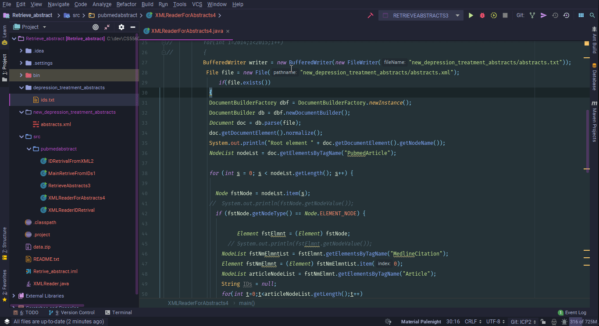
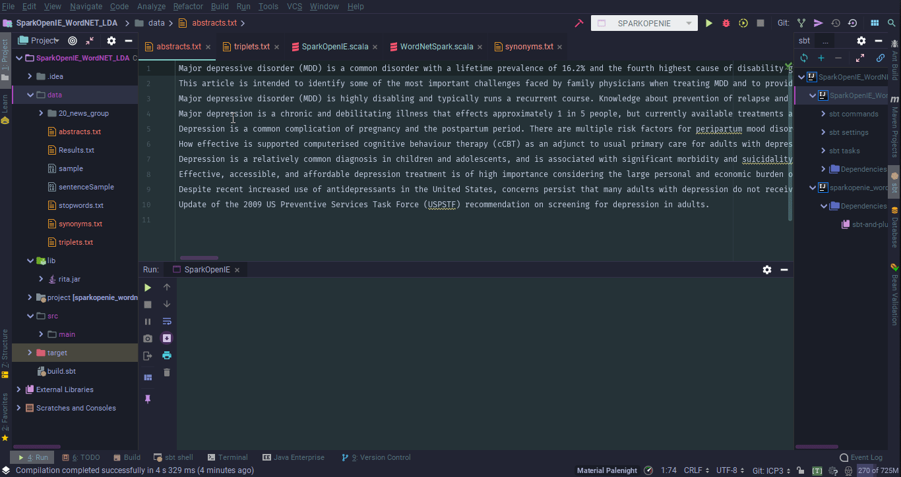
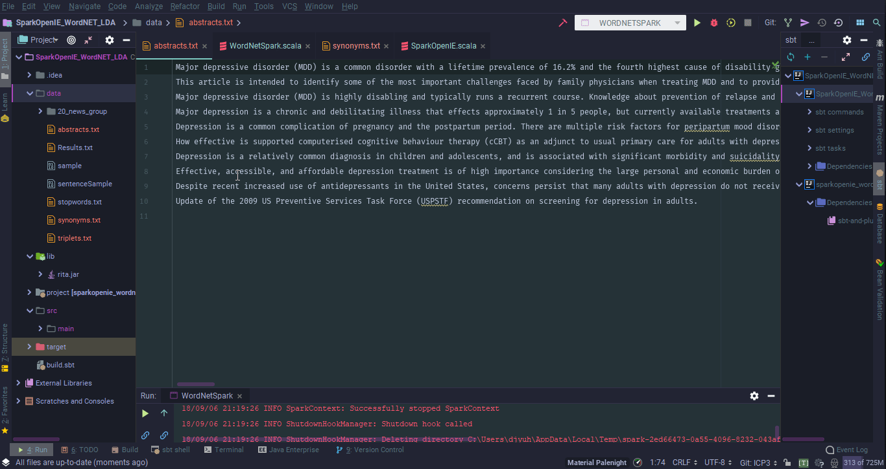

# KDM-Lab1

CS5560 Knowledge Discovery Management - Lab Assignment 1

# Introduction

For CS5560 Knowledge Discovery Management, Lab Assignment 1 will be working on the 10 abstracts I have found to be used as data sets for my team's project on Depression Treatment as required for each member the team. These abstracts are unique to the other team members' abstracts in order to retrieve and process as wide of range of data as possible.

The project's goal is to construct a Knowledge Graph specifically for the treatment of depression. These 10 abstracts, for this assignment, will undergo basic Natural Language Processing (NLP) such as Tokenization and Lemmatization. Then the abstracts will have Valid Word Filtering and Valid Medical Word Filtering performed on them. The purpose of this is to prepare our datasets for future lab assignments as we continue to work towards constructing the knowledge graph.

## Tasks

For the 10 abstracts relevant to the project topic, Depression Treatment, perform the following:

1. Report Data Statistics (e.g. Year of Publication, Number of terms presented in the paper, Number of images & graphs)
2. Perform Basic NLP (Tokenization, Lemmatization) and provide the statistics.
3. Perform Valid Word Filtering & Valid Medical Word Filtering and provide the statistics

## Setup

The following was provided by the instructor via zip files:

* WordNet-3.0 
* WinUtils.exe

[JetBrains IntelliJ](https://www.jetbrains.com/idea/) was used as the IDE to complete the assignment. This assignment required using the Java and Scala programming languages.

## Abstracts/Datasets

Below is the following abstracts I used for this Lab Assignment:

1. [Understanding the role of adjunctive nonpharmacological therapies in management of the multiple pathways to depression.](https://www.ncbi.nlm.nih.gov/pubmed/25539873)
2. [Optimizing the management of depression: primary care experience.](https://www.ncbi.nlm.nih.gov/pubmed/25539874/) 
3. [A lifetime approach to major depressive disorder: The contributions  of psychological interventions in preventing relapse and recurrence.](https://www.ncbi.nlm.nih.gov/pubmed/25754289)
4. [Emerging treatment mechanisms for depression: focus on glutamate and synaptic plasticity.](https://www.ncbi.nlm.nih.gov/pubmed/26854424) 
5. [Depression During Pregnancy and Postpartum.]( https://www.ncbi.nlm.nih.gov/pubmed/26879925)
6. [Computerised cognitive behaviour therapy (cCBT) as treatment for  depression in primary care (REEACT trial): large scale pragmatic  randomised controlled trial.](https://www.ncbi.nlm.nih.gov/pubmed/26559241)
7. [Management of Treatment-Resistant Depression in Children and Adolescents](https://www.ncbi.nlm.nih.gov/pubmed/25200567)
8. [European COMPARative Effectiveness research on blended Depression  treatment versus treatment-as-usual (E-COMPARED): study protocol for a  randomized controlled, non-inferiority trial in eight European countries](https://www.ncbi.nlm.nih.gov/pubmed/27488181)
9. [Treatment of Adult Depression in the United States](https://www.ncbi.nlm.nih.gov/pubmed/27571438)
10. [Screening for Depression in Adults US Preventive Services Task Force Recommendation Statement](https://www.ncbi.nlm.nih.gov/pubmed/26813211)

## Abstraction Steps:

- Retrieve Abstracts using HttpURLConnection to Pubmed for an xml file.

  - Use the [efetch xml example](https://dataguide.nlm.nih.gov/eutilities/utilities.html#efetch) from Pubmed and alter to get the abstract.

    

- From the XML file, put the abstracts into a text file for easier readability.

  

## Getting Triplets:

To retrieve the triplets, again I used source code provided by the instructor. The SparkOpenIE.scala file was used and modified to accommodate my abstracts.txt file.

The purpose of this is to identify the subject, predicate, object triplets as keywords alone cannot provide meaningful data. With these triplets we are able to see syntactic relationships of each sentence.

## Getting Synonyms:

To get the synonym for every word in the 10 abstracts, again I used source code provided by the instructor. The WordNetSpark.scala file was used and modified to accommodate my abstracts.txt file.

The purpose of identifying synonyms for every word in all of the abstracts is to find words that are truly synonymous with the particular word found in that instance of the text. For example, if the word *'process'* was found in the text, what is actually meant by that word? Is *'process'* a noun or is it a verb? If it is a noun, then synonyms related to process would be words such as *job, task, activity* and so on. If it is a verb, such as "I will process it", then synonyms would be words such as *handle, operate, engage* and so on.

# Source Code

The source code for this ICP was provided by the class instructor Mayanka ChandraShekar: [mckw9@mail.umkc.edu](mckw9@mail.umkc.edu)